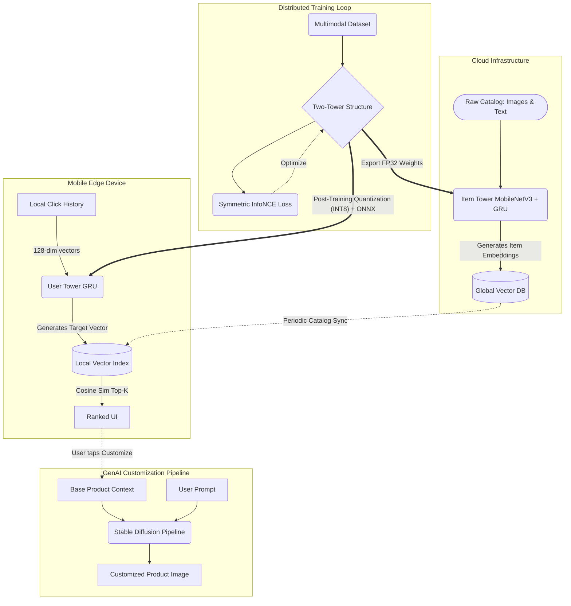

# Multimodal Edge RecSys: System Architecture

The following Mermaid diagram illustrates the end-to-end Machine Learning System Design pipeline, detailing the separation of concerns between Cloud precomputation, Edge inference, PyTorch Model Training, and Generative AI integration natively tailored for an ISE (Intelligent System Experience).

### Component Details
1. **Mobile Edge Device (Orange):** Represents the on-device execution environment. The `User Tower` handles sequential data. Privacy is maximally protected because the user's `Click History` never transits the network.
2. **Cloud Infrastructure (Green):** Represents the batch ingestion of new catalog items, offloading heavy Multi-modal encoding (Vision+Text representation) to the cloud.
3. **Training Pipeline (Purple):** Represents the shared InfoNCE modeling phase integrating PyTorch Lightning for cluster training.
4. **GenAI Pipeline (Yellow):** Represents the post-recommendation RAG interface letting users synthesize completely novel products from existing ones using fine-tuned Diffusion models.
